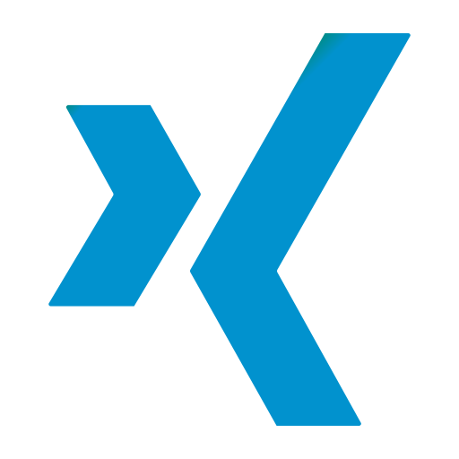

  

  

  

  
  
  

---

### 👨‍💻 About Me

I actively explore different technologies from web development to desktop and backend systems, continuously improving my skills through hands-on projects, experimentation, and learning.  
Each project I build is an opportunity to optimize workflows, enhance user experience, and apply best practices in real-world scenarios. I enjoy creating software that feels clean, useful, and thoughtful.

  <i>"My goal is to become a skilled software engineer and continuously improve my development skills."</i>

---

### 🚀 What I Bring

<table align="center" width="100%">
  <tr>
    <td width="33%" valign="top" align="center">
      <h3>🛠️ Build Mindset</h3>
      
Turning ideas into practical applications with clear structure, useful features, and a better user experience.

    </td>
    <td width="33%" valign="top" align="center">
      <h3>📚 Learning Style</h3>
      
Learning best by building real projects, experimenting with tools, and improving things step by step through practice.

    </td>
    <td width="33%" valign="top" align="center">
      <h3>🎯 Current Direction</h3>
      
Growing across web, desktop, and backend development while sharpening coding standards and problem-solving skills.

    </td>
  </tr>
</table>

---

### 🧰 Tech Stack & Tools

  

  
<b>✨ Click to expand Detailed Tech Areas</b>

   
  <table align="center" width="100%">
    <tr>
      <td width="33%" valign="top">
        <h3 align="center">💻 Programming</h3>
        

          
          
          
          
          
          
        

      </td>
      <td width="33%" valign="top">
        <h3 align="center">🌐 Web Dev</h3>
        

          
          
          
          
          
        

      </td>
      <td width="33%" valign="top">
        <h3 align="center">⚙️ Tools</h3>
        

          
          
          
          
          
          
        

      </td>
    </tr>
  </table>

---

### 📈 GitHub Stats

  

---

### 🐍 Contribution Activity

  <picture>
    <source media="(prefers-color-scheme: dark)" srcset="https://raw.githubusercontent.com/Kaisecret/Kaisecret/output/github-snake-dark.svg" />
    <source media="(prefers-color-scheme: light)" srcset="https://raw.githubusercontent.com/Kaisecret/Kaisecret/output/github-snake.svg" />
    
  </picture>

---

  

  

